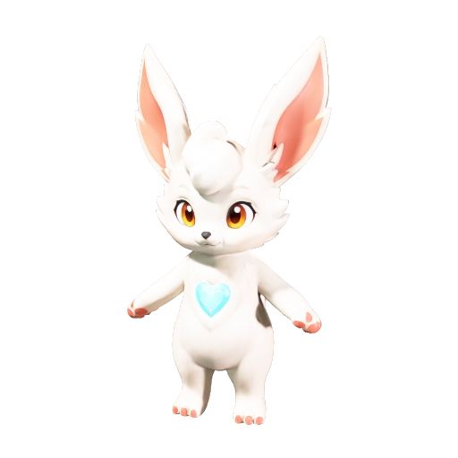

# NEXORA CORE

NEXORA CORE 是一个内部保密的随身 AI 情感伙伴产品原型。伙伴以原创 3D 生物形象出现，可以在手机、电脑桌面和 NC-01 项链圆屏模拟器中互动，并通过持续对话形成名字、生日、性格、记忆与成长阶段。未经书面授权，不得复制、分发、公开或用于衍生产品。

[在线体验](https://nexora-core-ai.netlify.app/soulmate/) · [项链 3D 运行台](https://nexora-core-ai.netlify.app/pendant-display/) · [X / Twitter @yesp999](https://x.com/yesp999)



## 三种初始伙伴

| 路线 | 伙伴 | 风格 | 默认声线 |
| --- | --- | --- | --- |
| 可爱 | LUMO / 露莫 | 温暖、活泼、亲近 | 幼灵 |
| 帅气 | VEYR / 维尔 | 锐利、克制、守护 | 锋鸣 |
| 优美 | AERA / 艾拉 | 空灵、安静、细腻 | 星语 |

每个伙伴包含幼体、成长体、共鸣体三套原生 GLB 模型，以及待机、亲近、点头、招手、说话、行走和跑步动作。点击伙伴会打开动作面板，也可以在开启语音唤醒后用伙伴名字控制招手、点头、靠近、行走、奔跑和停下。动作片段在同一路线的标准骨骼上缓存并平滑切换，三只伙伴也分别拥有独立的对话性格和声线。项链网页只显示 3D 角色，不再提供 2D 造型切换。

共鸣成长会同时改变人格参数、阶段名称和实际 3D 外形。每条路线在共鸣值达到 `80` 和 `240` 时进入下一形态，共计九套独立 3D 造型。

## 当前能力

- 首次开机设置名字、生日、性别、初始伙伴和声线。
- 文字或语音对话、伙伴名字唤醒和语音动作控制，并保存版本化的偏好、事实、事件、情绪和关系记忆。
- 三条原创伙伴路线、九套成长形态和独立动作资源。
- 手机端、透明桌面端、`240 x 240` 项链圆屏和电脑三端测试台。
- 可选的端到端加密跨设备同步，通过恢复码在新手机或电脑继续同一个伙伴。
- Web Bluetooth 身份与状态同步协议。
- Netlify Functions 聊天与云端神经语音接口。
- ESP32-S3 NC-01 固件、3D 打印外壳、切片模拟和装配资料。

## 快速运行

需要 Node.js 20 或更新版本。

```bash
git clone https://github.com/yespsam/nexora-core.git
cd nexora-core
npm install
npx netlify dev
```

启动后打开：

```text
http://localhost:8888/soulmate/
http://localhost:8888/pendant-display/
http://localhost:8888/device-lab/?autorun=1
```

项目可以在没有开发板时完成手机端、项链端、BLE 数据、对话、语音和角色动作模拟。

## 验证

```bash
npm test
npm run test:computer
```

`npm test` 检查聊天、人格、3D 资源、BLE 协议、项链状态和语音配置。`npm run test:computer` 还会编译 ESP32-S3 固件并运行 NC-01 数字样机实验。

## 项目结构

| 路径 | 内容 |
| --- | --- |
| `soulmate/` | 手机端伙伴与对话界面 |
| `pendant-display/` | 只显示 3D 角色的 NC-01 圆屏模拟器 |
| `device-lab/` | 手机、电脑与项链联合自动测试台，仅在私有本地环境发布 |
| `NEXORA_3D_CREATURES/` | LUMO、VEYR、AERA 模型与动作 |
| `shared/` | 人格、BLE、3D 和状态机共享模块 |
| `netlify/functions/` | 聊天、语音、密文同步、设备云和维护云函数 |
| `cloud/` | 实体设备 PostgreSQL 迁移、事件存储和密钥边界，不进入公开发布包 |
| `hardware/soulmate-pendant/` | 固件、外壳、打印和实验资料 |

## 硬件状态

当前目标板为 Waveshare ESP32-S3-LCD-1.28，圆屏分辨率为 `240 x 240`。浏览器端直接运行 WebGL 3D；实体低功耗固件需要将同一角色设计转换为适合 ESP32-S3 的显示资源。

实体版本的云端基线为“BLE 项链 + 手机网关 + PostgreSQL 只追加密文事件 + 加密对象快照”。详细的数据分类、设备撤销、密钥轮换、保留期限与迁移步骤见 [`docs/NEXORA_DEVICE_CLOUD_ARCHITECTURE.md`](docs/NEXORA_DEVICE_CLOUD_ARCHITECTURE.md)。本机 PostgreSQL 已通过三设备、1000 条密文事件、快照压缩、撤销、恢复和数据库/对象联合删除闭环；Netlify Identity 私有测试云见 [`docs/NEXORA_PRIVATE_CLOUD_STAGING.md`](docs/NEXORA_PRIVATE_CLOUD_STAGING.md)，production 默认关闭，仅隔离测试分支启用。

电脑模拟不能替代实体麦克风、扬声器、IMU、电池温升、蓝牙距离、跌落和佩戴强度测试。

## API 与隐私

不要把 API Key 提交到 GitHub。开发环境使用 `.env` 或 `.env.local`，线上 Kimi 密钥只配置为 Netlify Secret `LLM_API_KEY`；浏览器、手机和项链端均不接收或保存模型凭据。伴侣资料默认保存在用户浏览器本地，项链 BLE 快照只同步必要的身份、成长和即时状态字段。

跨设备同步需要用户主动开启。名字、人格、记忆和对话会先在设备上使用 AES-256-GCM 加密，服务器只保存密文、版本号和访问令牌哈希。恢复码包含解密密钥且不会上传；遗失后服务器和项目方都无法代为找回。

## 保密与协作

仓库仅供获得授权的项目成员使用。问题、角色动作改进、硬件验证结果与新功能应在私有仓库内提交，不得将源代码、模型、固件、打印文件、产品路线或测试数据转发到公开渠道。对外产品动态发布在 [X / Twitter @yesp999](https://x.com/yesp999)。

## 权利声明

当前私有版本采用 [NEXORA CORE Proprietary Notice](LICENSE)，保留所有权利。此前已经随 MIT License 公开分发的历史版本，继续受其当时附带的许可约束。
