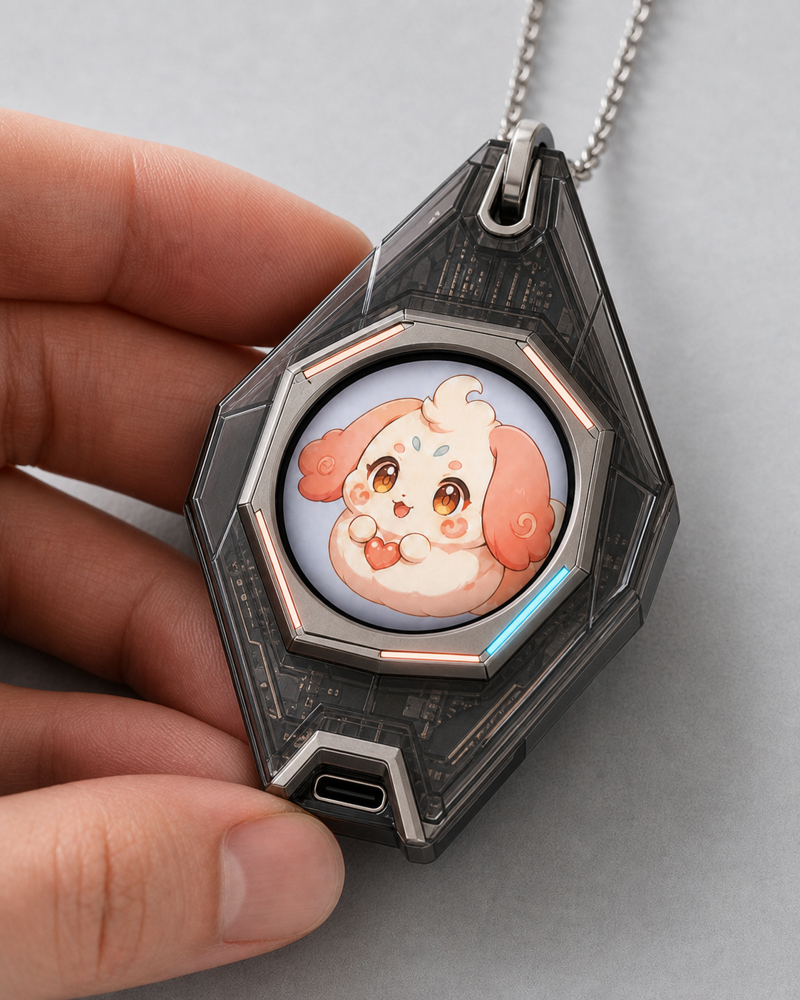
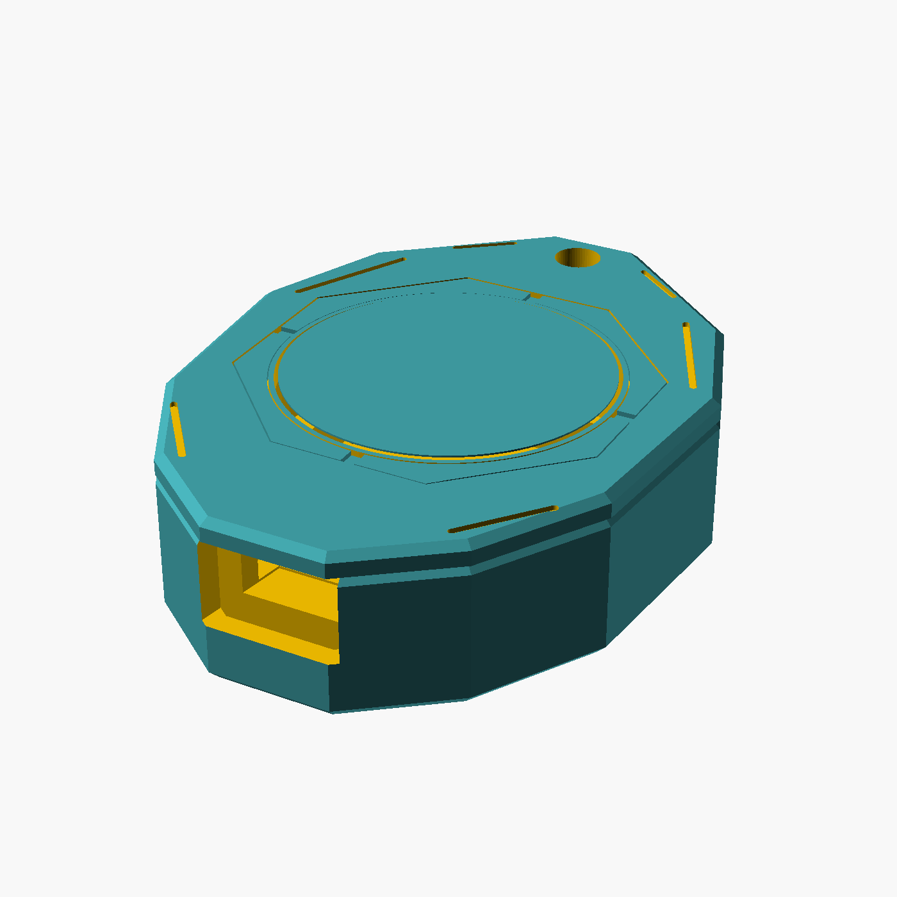

# NEXORA CORE NC-01 3D 打印原型

`NEXORA CORE` 是佩戴在胸前的情感 AI 核心。`NC-01` 将圆形角色屏幕放入多面切割的护盾轮廓中，采用烟灰主体、金属感八边形前框和四段状态灯导环。可爱、帅气、美丽三种伙伴由屏幕和软件选择，不再要求用户拆卸、更换角色外壳。



上图是外观设计渲染，并非打印照片。下面的 CAD 预览和导出文件才是当前可打印结构。



## 打印文件

| 文件 | 建议材料 | 用途 |
| --- | --- | --- |
| `stl/nexora-core-body.stl` | 烟灰透明 PETG | 多面后壳、主板仓、电池仓和后置固定孔 |
| `stl/nexora-core-front-frame.stl` | 深灰或金属色 PETG | 八边形屏框、技术线槽和背部螺丝柱 |
| `stl/nexora-core-light-guide.stl` | 透明或半透明 PETG | 一次打印的四块独立状态灯导光条 |
| `nexora-core-nc01-kit.3mf` | 多材料打印盘 | 三个零件已排版的整套模型 |
| `source/soulmate-pendant.scad` | - | 可修改参数的 OpenSCAD 源文件 |
| `firmware/` | - | ESP32-S3 圆屏、BLE 同步、电量与休眠固件工程 |
| `nexora-core-nc01-print-pack.zip` | - | 完整压缩包；运行数字实验后同时包含报告 |

## 结构尺寸

- 外部包络：约 `50 x 67 x 17 mm`。
- 后壳深度：`14.8 mm`；前框厚度：`2.2 mm`。
- 圆屏开口：`33.2 mm`，适配 `32.4 mm` 有效显示区域。
- 吊环孔：`4.8 mm`，位于金属加固件建议区域。
- 内部服务仓：`31.5 x 28 x 5.8 mm`。
- PETG 切片总重量约 `23.7 g`，不含电子件、螺丝和链条。
- 三颗 M2 固定螺丝全部从背面装入，正面无外露螺丝。
- 底部为梯形下沉式 USB-C 通道。

## 适配硬件

原型继续按 Waveshare `ESP32-S3-LCD-1.28` 官方 STEP 尺寸设计。主板外形约 `36.523 x 39.512 x 7.9 mm`，壳体保留至少 `0.8 mm` 的总装配余量。

建议首版物料：

- Waveshare ESP32-S3-LCD-1.28 圆屏主板一块。
- 带保护板的 `3.7 V` 锂聚合物电池，首轮试装建议 `301230` 规格。
- 小型 I2S MEMS 麦克风、I2S 功放和薄型扬声器。
- 三颗 `M2 x 6 mm` 塑料自攻螺丝。
- 四段柔性 LED 或四颗侧发光 LED，以及四块透明导光条。
- 绝缘胶带、薄泡棉和电池固定胶。

精确的三台 EVT-A 参考料号、当前预算、暂停采购项和无冲突 GPIO 计划见 [`../../docs/NC01_EVT_A_PROCUREMENT.md`](../../docs/NC01_EVT_A_PROCUREMENT.md)。开发板式麦克风、功放、电池、扬声器和震动马达的最低包络体积已经超过当前服务仓，首轮必须先做桌面接线验证，再为佩戴版设计集成小板。

主板自带 Wi-Fi、BLE、充放电管理和六轴传感器，但没有完整的麦克风与扬声器链路。语音器件、灯环驱动和电池仍需在首件中验证。

## 打印参数

- `0.4 mm` 喷嘴，`0.16-0.2 mm` 层高，三道外墙，`25%` 填充。
- 后壳背面朝下打印；前框导光槽朝下；四块导光条平放打印。
- 后壳和前框建议 PETG，首轮尺寸验证也可使用 PLA。
- 导光条使用透明 PETG，`100%` 填充；打印后用 `600-1000` 目砂纸轻磨以增强漫反射。
- 三个零件按当前导出方向不需要主体支撑；USB-C 短桥可开启桥接优化。
- 先打印前框和导光条，确认卡槽公差后再打印完整后壳。

## 装配顺序

1. 将四块导光条分别从前框正面压入对应灯槽，确认灯条没有翘起。
2. 从前方放入圆屏主板，检查屏幕、前框和 USB-C 中线。
3. 在服务仓固定电池与音频小板，所有焊点完成绝缘。
4. 将前框的三个定位柱插入后壳定位孔。
5. 从背面装入三颗 M2 螺丝，均匀锁紧，正面不应出现紧固件。
6. 通电检查灯环、充电温升、麦克风回声、扬声器振动和吊环受力。

## 安全边界

尖锐感来自平面切割线和倒角反差，实际贴肤边缘仍保留安全倒角。当前模型是功能样机，不具备防水、跌落、皮肤接触材料、锂电池热失控或吊环疲劳认证。佩戴测试前必须使用带保护板的合格电池，并完成温升、绝缘和拉力检查。

重新生成全部文件：

```bash
npm run build:pendant
```

构建脚本会导出 STL、3MF、预览图和 ZIP，并拒绝存在开口边或非流形边的打印件。产品渲染图会被保留，不会在重新构建时删除。

运行数字样机实验：

```bash
npm run simulate:pendant
```

实验使用 PrusaSlicer、通用 PETG、`0.4 mm` 喷嘴、`0.2 mm` 层高、三道外墙和无支撑设置。当前结果为 `23.66 g / 2h 50m 12s`，三个 STL 均无切片警告；完整记录见 [`experiments/nc01-simulation-report.md`](experiments/nc01-simulation-report.md)。

构建真正运行在项链主板上的圆屏固件和角色资源：

```bash
npm run build:pendant-firmware
npm run build:pendant-firmware-fs
```

固件使用说明、BLE 快照格式和上板边界见 [`firmware/README.md`](firmware/README.md)。
