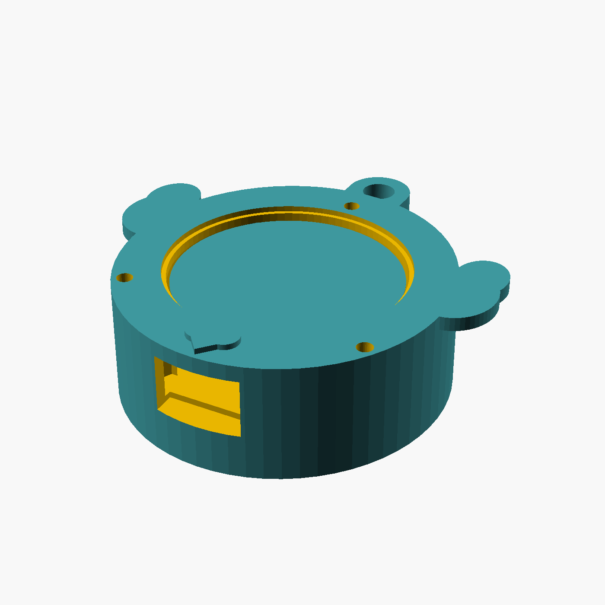
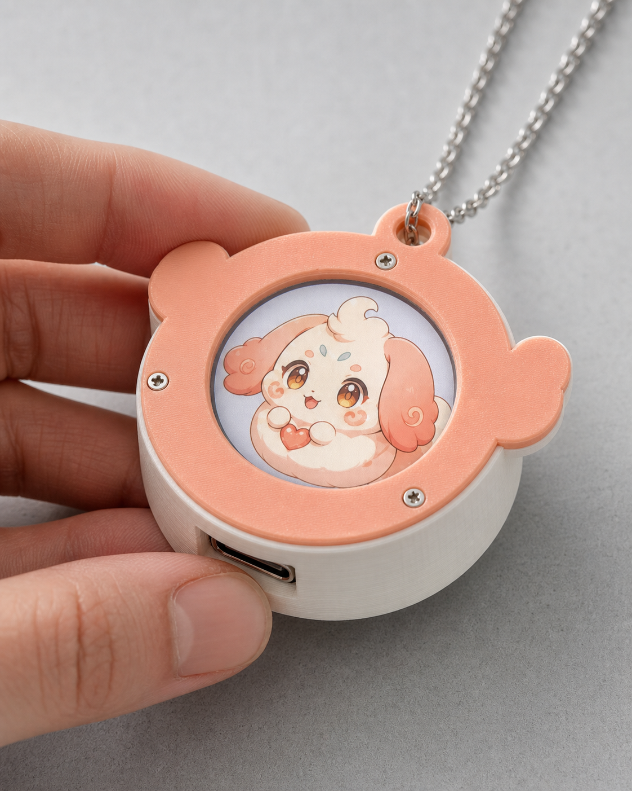

# Soulmate 3D 打印项链原型

这套文件把 Soulmate 做成可佩戴的圆屏吊坠。通用后壳容纳电子模组，三款前盖对应绒云兽、曜影兽和月羽灵。角色动画显示在屏幕里，前盖负责把伙伴的外形语言延伸到实体轮廓。



下图是依据现有 CAD 尺寸、FDM 打印材质和绒云兽屏幕画面制作的实物效果渲染，并非已经打印完成的样机照片。



## 打印文件

| 文件 | 用途 |
| --- | --- |
| `stl/soulmate-pendant-body.stl` | 通用电子后壳，只打印一个 |
| `stl/soulmate-face-cute.stl` | 绒云兽软耳前盖 |
| `stl/soulmate-face-cool.stl` | 曜影兽尖耳前盖 |
| `stl/soulmate-face-beautiful.stl` | 月羽灵羽翼前盖 |
| `soulmate-pendant-kit.3mf` | 四个零件已经排版的整套打印盘 |
| `source/soulmate-pendant.scad` | 可修改尺寸的 OpenSCAD 源文件 |

## 原型尺寸

- 通用壳体：`46.8 x 58.6 x 15.2 mm`，含顶部吊环。
- 装配厚度：约 `17.1 mm`，装饰浮雕最高处约 `18.0 mm`。
- 圆屏开口：`33.2 mm`。
- 吊环孔：`4.8 mm`。
- 内部服务仓：`31.5 x 28 x 5.8 mm`。
- 壳体加任一前盖的 PLA 估算重量：约 `20 g`，不含电子件和电池。

## 适配硬件

原型按 Waveshare `ESP32-S3-LCD-1.28` 官方 STEP 模型设计。官方模型外形约为 `36.523 x 39.512 x 7.9 mm`，有效显示直径 `32.4 mm`。壳体预留约 `0.88 mm` 横向和 `1.09 mm` 纵向总间隙。

建议首版物料：

- Waveshare ESP32-S3-LCD-1.28 圆屏主板一块。
- 带保护板的 `3.7 V` 锂聚合物电池，首轮试装建议 `301230` 规格。
- 小型 I2S MEMS 麦克风、I2S 功放和薄型扬声器。
- 三颗 `M2 x 6 mm` 塑料自攻螺丝。
- 绝缘胶带、薄泡棉和电池固定胶。

主板自带 Wi-Fi、BLE、充放电管理和六轴传感器，但官方板载资源不包含完整的麦克风与扬声器链路，因此语音器件仍需单独验证。

## 打印参数

- 首次试装用 PLA；贴身长期使用优先 PETG。
- `0.4 mm` 喷嘴，`0.2 mm` 层高，三道外墙，`25%` 填充。
- 后壳背面朝下打印，前盖平面朝下、浮雕朝上。
- 四个零件都不需要支撑；USB 开口可启用短桥接优化。
- 先打印后壳和一个前盖验证公差，再打印另外两款。

## 装配顺序

1. 空壳试装主板，确认屏幕、USB-C 和三个螺丝孔对齐。
2. 在后部服务仓固定电池和音频小板，所有焊点必须绝缘。
3. 从正面放入主板，让圆屏与开口同心。
4. 盖上选定前盖，用三颗 M2 螺丝均匀锁紧。
5. 通电后检查充电温升、麦克风回声、扬声器振动和吊环受力。

## 安全边界

这是功能样机外壳，不是量产结构。当前版本未做防水、跌落、皮肤接触材料、锂电池热失控或吊环疲劳认证。佩戴测试前必须使用带保护板的合格电池，并完成充电温升和绝缘检查。

重新生成模型：

```bash
npm run build:pendant
```

构建脚本会导出 STL、3MF 和预览图，并拒绝存在开口边或非流形边的打印件。
